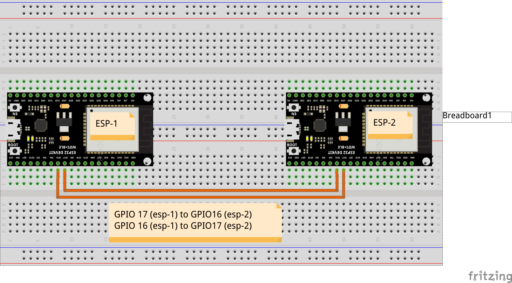
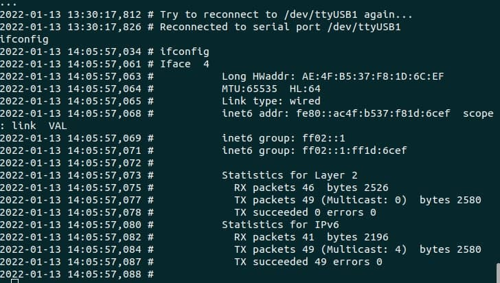
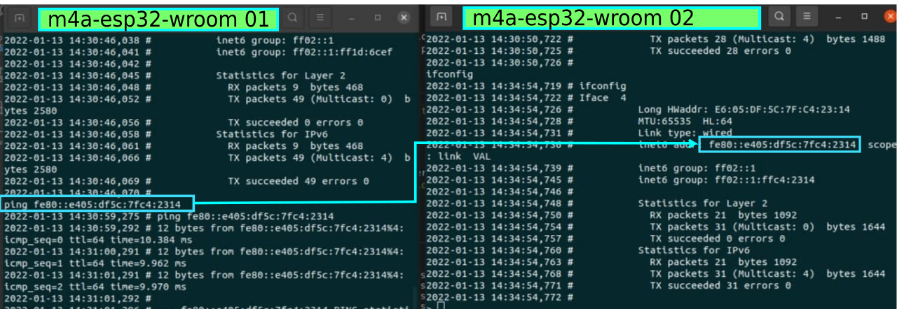

# m4a-wroom examples

<h2 align=center> Slipdev</h2>

### Getting Started:

Follow the next steps:

<br>

 ### Build this example in your breadboard

<br>



<br>

### Go to the example folder

```sh
cd examples/esp-wroom32/slipdev
```

### Compile your code and flash it

```sh
make flash term
```

## First
check your interface configuration
```sh
ifconfig
```
When you enter this command you should be watching the next output:


 take note about the mac address (Long HWaddr) and the Link local address (inet6 addr that starts with fe80), if you can see and compare the mac address and the link local address, we can see that both address has some sames values. This is eui-64, an address generated from the mac address.

## Second
Start making a test, take the link local address from the other esp32 and do ping

