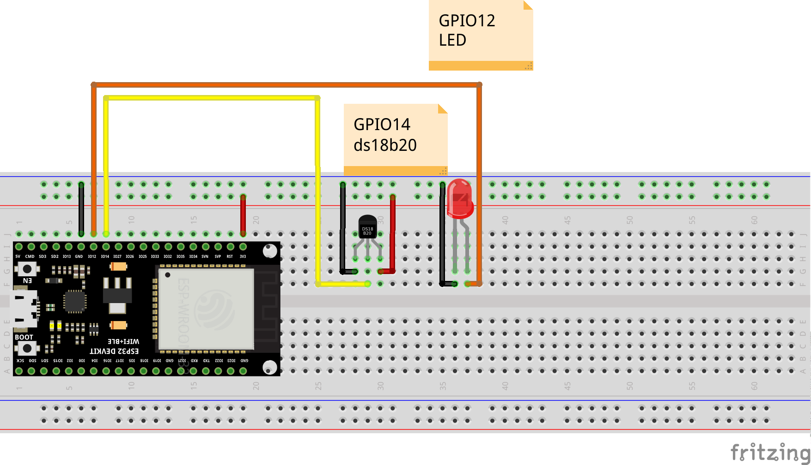

# Esp32-wroom examples

<h2 align=center> ds18b20 </h2>

### Getting Started:

Follow the next steps:

<br>

 ### Build this example in your breadboard

<br>



<br>

### Go to the example folder

```sh
cd examples/esp-wroom32/test_ds18b20
```

### Compile your code and flash it

```sh
make flash term
```

Check your code to understand functionalities

## First
Define a ds18 sensor
```c
ds18_t sensor
```
## Second
Define ds18 params
```c
ds18_params_t dev ={
     .pin = sensor_pin,
     .out_mode = sensor_mode_out // OUT_OPRN_DRAIN_PULL UP
     .in_mode = sensor_mode_in
 }
```
## Last steps
Initialize the device
```c
ds18_init(&dev,&dev_params); // Set the params to your sensor
```
Check the temperature
```c
ds18_get_temperature(&dev,&var_temperature); // var_temperature has to defined previously as int16_t variable
```
